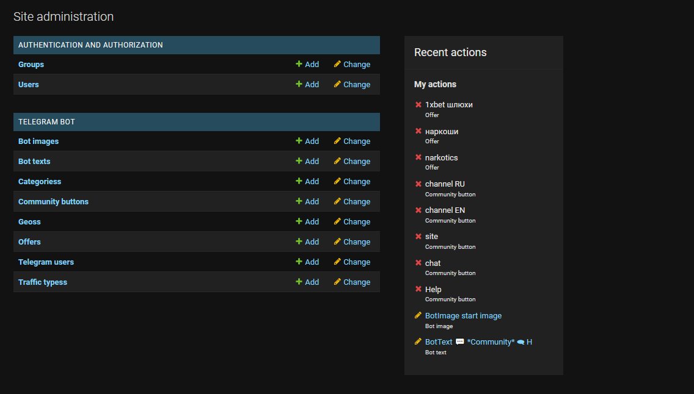
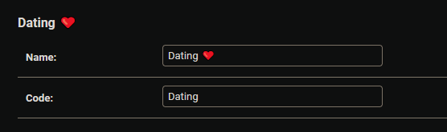
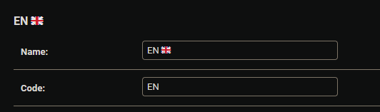

# Crypto Django Aiogram Bot

### Настройка 

Откройте файл `template.env`
Он содержит

```
# This is a template file for .env file

# Address of the domain where the bot is hosted
SECRET_KEY=django-insecure  # change this to a random string
DEBUG=True
ALLOWED_HOSTS=0.0.0.0,127.0.0.1,localhost,<ip address of your domain>

# add your bot token and admin id
BOT_TOKEN=<tg bot token>
ADMINS_LIST=<your telegram id>
```

Поменяйте значения на ваши. Рядом написаны комментарии, что на что менять.

> После замены информации в файле `template.env` обязательно ПЕРЕИМЕНУЙТЕ его в `.env`. БЕЗ РАСШИРЕНИЯ, ничего кроме `.env` в названии файла быть не должно.

### Запуск программы в работу.

Для того чтобы запустить бота (и веб интерфейс админ панели) есть два способа:
- с использованием docker (удобнее)
- самостоятельный запуск (дольше)

##### Запуск через Docker

Все очень просто.

Переходите на свой сервер, где лежит ваша программа и вводите следующую команду:

```sh
docker build -t crypto_django_aiogram_bot . ; docker run -p 8000:8000 crypto_django_aiogram_bot
```

Название _crypto_django_aiogram_bot_ можете заменить на более вам удобное.

##### Самостоятельный запуск

Создайте виртуальное окружение для python или используйте conda. Обязательно сделайте это, в проекте используются специфичные версии библиотек (чтобы все работало корректно). Не забудьте его активировать.


1) Устанавливаем зависимости
```sh
pip install -r ./requirements.txt
```

2) Запускаем сервер Джанго

```sh
python ./manage.py runserver
```

> Обратите внимание! Порт 8000 на вашем сервере должен быть открыт, чтобы вы могли подключиться к панели. 
> Также обязательно учтите, что закрывать окно/процесс с данной командой НЕЛЬЗЯ. Он должен работать вечно.

3) Запускаем тг бота

```sh
python ./manage.py runbot
```

> Эта команда также должна работать вечно.

##### Как убедиться, что все работает.

Перейдите по адресу https://ip_вашего_сервера:8000/admin

Там вы найдете вашу будущую админ панель. Креды по умолчанию `admin:123`. Все спокойно меняется внутри админки.

Для того чтобы убедиться в том, что работает бот - перейдите в своего бота и попробуйте с ним повзаимодействовать.

> Обратите внимание! Изначально в боте стоят текста, которые установил я. Далее расписано, что к чему относится и как все поменять.

### Как пользоваться админ. панелью.



При открытии панели в первый раз вы увидите что-то такое.


##### Замена картинок

Слева видна графа `Bot images`. Если нажать на нее высветятся все доступные изображения.
Среди них `start image` - картинка которая появляется при старте бота. Достаточно просто отредактировать этот элемент и все, все в боте поменяется.

##### Замена текстов

Работает аналогично замене картинок, но находится в таблице `Bot texts`.

Текстов больше (гораздо), вот что за что отвечает:

- `start text` - текст, который появляется при самом первом старте бота пользователем
- `main menu ru` и `main menu en` - текст, который появляется при выпадении Главного меню. Для русского языка и для английского соответственно.
- `offers clicked ru` и ``offers clicked en` - текста, которые появляются, если пользователь выбрал графу "OFFERS". 
- `offers category chosen en` и `offers category chosen ru` - текста, которые появляются, после того как пользовтель выбрат категорию офера
- `offers geo chosen ru` и `offers geo chosen en` - текста, которые появляются после того, как пользователь выбрал гео офера.
- `payments ru` и `payments en` - текста при выборе "PAYMENTS".
- `statistics ru` и `statistics ru` - текста при выборе "STATISTICS"
- `community ru` и `community en` - текста при выборе "STATISTICS"

##### Фильтрация оферов. Добавление категорий, гео и типов траффика.

Добавить категорию можно в таблице `Categoriess`, там два поля: `name` и `code`.

`name` - то, что будут видеть пользователи, красивая кнопочка.
`code` - то, что будет отправлено на сервер, при выбор этой опции. 

Вот примерно того как надо заполнять категорию:



Редактировать Гео можно в таблице `Geoss`, там тоже два поля: `name` и `code`.
Логика идентичная:



Редактировать типы траффика можно в `Traffic typess`. Там одно поле `name`.


> gf & hf
